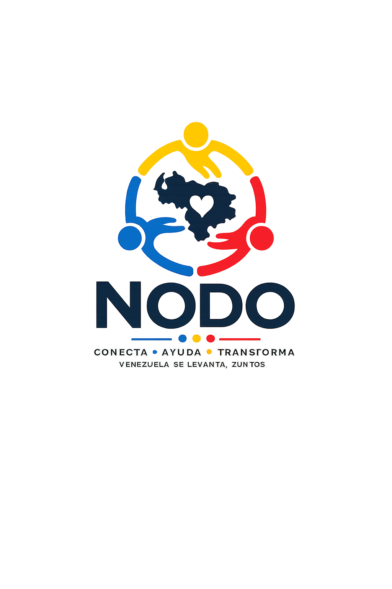

<p align="center">
  
</p>

<h1 align="center">NODO</h1>

<p align="center">
  <strong>Plataforma de Inteligencia Humanitaria</strong><br>
  Centro Nacional de Coordinacion Ciudadana para Emergencias en Venezuela
</p>

<p align="center">
  <a href="https://www.nodoayuda.com">nodoayuda.com</a> ·
  <a href="MANIFESTO.md">Manifiesto</a> ·
  <a href="CONTRIBUTING.md">Contribuir</a> ·
  <a href="onboarding/">Onboarding</a>
</p>

---

## NODO no compite con otras plataformas humanitarias. Las conecta.

NODO es la infraestructura que permite que plataformas independientes de ayuda humanitaria trabajen juntas. Una sola busqueda consulta todas las fuentes, fusiona resultados, elimina duplicados, verifica la evidencia y presenta un unico resultado consolidado.

---

## Mision

Convertir informacion fragmentada en acciones coordinadas que salvan vidas.

---

## Como funciona

```
Usuario busca "Maria Gonzalez"
         │
    ┌────┴────┐
    │ Paralelo │
    ├──────────┤
    │ NODO DB  │  Supabase
    │ 6 Nodos  │  Federation Engine
    └────┬─────┘
         │
    Deduplicacion → Evidence Engine → Context Engine → Brief
         │
    Vista unificada consolidada
```

### Motores

| Motor | Funcion |
|-------|---------|
| Federation Engine | Busqueda adaptativa multi-fuente con cache y rate-limit |
| Evidence Engine | Verificacion multi-fuente (verified / corroborated / single / unconfirmed) |
| Humanitarian Context | Relaciones automaticas entre entidades |
| Humanitarian Brief | Resumen ejecutivo con puntuacion de confianza |
| Humanitarian Index | Agregacion por tipo de entidad |
| Situation Center | Dashboard nacional de la Red NODO |

### Red NODO — Nodos conectados

| Nodo | Registros | Entidades |
|------|-----------|-----------|
| Hospitales en Venezuela | 20 | hospital |
| Venezuela Te Busca | 10 | person |
| Desaparecidos Terremoto | 12 | person |
| VzlaAyuda | 12 | person, shelter, resource |
| Patitas a Salvo | 10 | pet |
| Reencuentro Venezuela | 15 | person |

---

## Stack

| Tecnologia | Proposito |
|-----------|-----------|
| Preact + Signals | UI reactiva (6KB) |
| Supabase | Base de datos (solo anon key) |
| Leaflet | Mapas |
| Tailwind CSS v4 | Estilos |
| Vite + PWA | Build + offline |
| TypeScript | Tipado estricto |

---

## Setup local

```bash
git clone https://github.com/nodo-venezuela/nodo.git
cd nodo
npm install
cp .env.example .env.local
# Editar .env.local con credenciales de Supabase
npm run dev
```

### Verificar

```bash
npx tsc -b && npx vite build
```

---

## Estructura del proyecto

```
src/
├── pages/              Vistas
├── components/         UI reutilizable
├── store/              Estado reactivo (signals)
├── lib/                Logica de negocio
│   └── connect/        Federation Engine
│       └── connectors/ Nodos federados
├── hooks/              Efectos reutilizables
├── design/             Design system tokens
├── assist/             Motor de IA conversacional
└── types/              Definiciones TypeScript

onboarding/             Guia para nuevos contribuidores
supabase/migrations/    Esquema de base de datos
```

---

## Contribuir

Ver [CONTRIBUTING.md](CONTRIBUTING.md) para instrucciones completas.

La forma mas rapida de contribuir: **crear un nuevo conector** para conectar otra plataforma a la Red NODO. Ver [onboarding/05-First-Contribution.md](onboarding/05-First-Contribution.md).

---

## Licencia

[AGPL-3.0](LICENSE.md) — El codigo es libre. Las mejoras deben compartirse.
